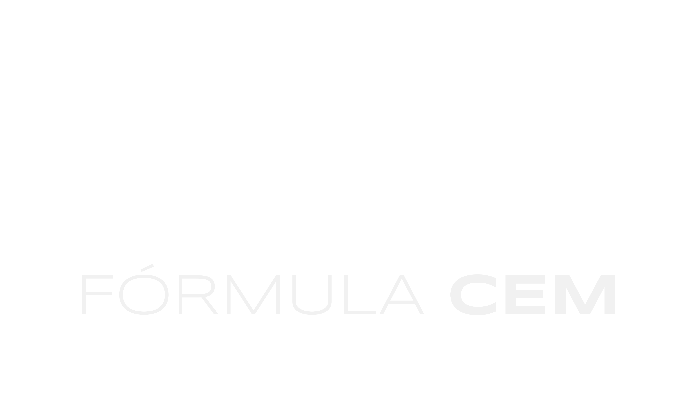
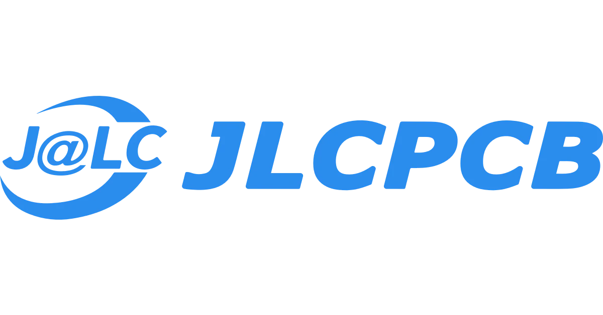
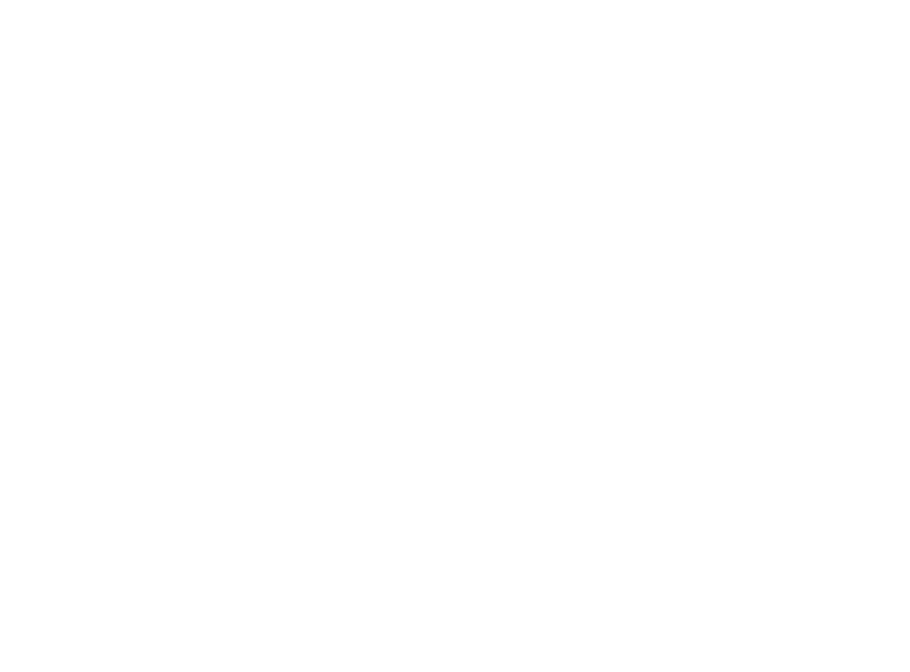

# TSAL - Tractive System Active Light

> Estamos focados em ajudar equipes a começarem no mundo do FSAE Elétrico! Verifique nossos outros repositórios para uma visão geral dos sistemas de segurança e qual foi nossa abordagem para solucionar os problemas ao longo dos anos.

### Ajustes e melhorias

O projeto está em constante desenvolvimento e a sua contrbuição seria muito bem vinda, as atualizações periódicas, bem como os arquivos de fabricação, projeto e código fonte serão disponibilizados de acordo com o desenvolvimento, teste e validação dos sistemas!

## Brake System Plausibility Device

Antes de começar, saiba que uma descrição mais detalhada pode ser encontrada [aqui](https://drive.google.com/file/d/1Le9ISAA1FhbQ6ooLTJnMWj3ilF0zkIrC/view?usp=sharing). Neste repositório você poderá encontrar:

* Revisão comentada, passo-a-passo de projetos anteriores, com o apontamento de erros e observações sobre as nuances dos projetos.
* Arquivos de fabricação atualizados, cujas PCB's foram fabricadas, graças ao apoio do nosso patrocinado [JLC PCB](https://jlcpcb.com/), testadas e validadas dentro da equipe.
* Documentação extensiva e possibilidade de contribuir com um time multidisciplinar.

## Contribuindo

Para contribuir, o recurso das *branches* tradicional do GitHub poderá ser utilizado, futuramente *branches* mais maduros podem se tornar o *Main* do componente. Por questões de comunicação clara e para que o trabalho ocorra de maneira síncrona

Como alternativa, consulte a documentação do GitHub em [como criar uma solicitação pull](https://help.github.com/en/github/collaborating-with-issues-and-pull-requests/creating-a-pull-request).

## Colaboradores

Agradecemos aos seguintes contribuintes para que este projeto saísse do papel:

<table>
  <tr>
    <td align="center">
      <a href="#">
         
        
          <b>JLC PCB</b>
      </a>
    </td>
  </tr>
</table>

## Licença

Esse projeto está sob licença. Veja o arquivo [LICENÇA](LICENSE.md) para mais detalhes.

[⬆ Voltar ao topo](#nome-do-projeto) 
